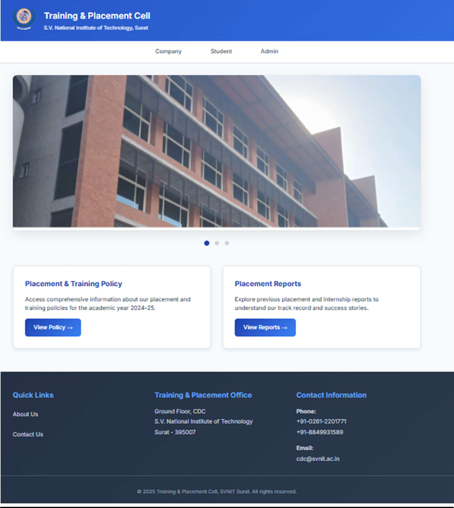
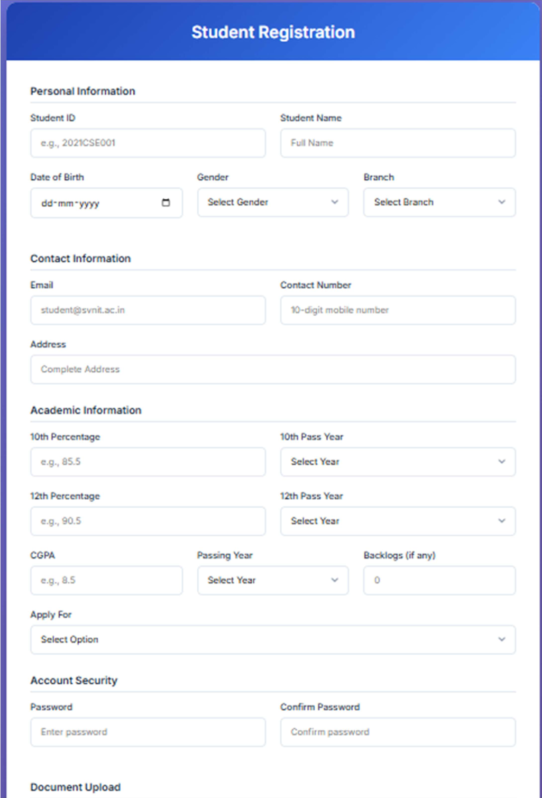
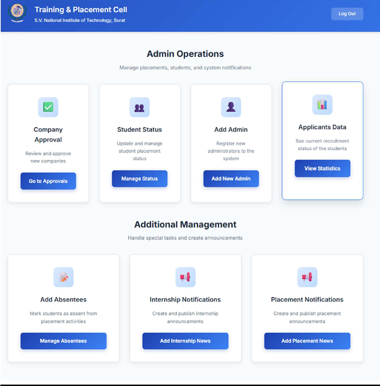
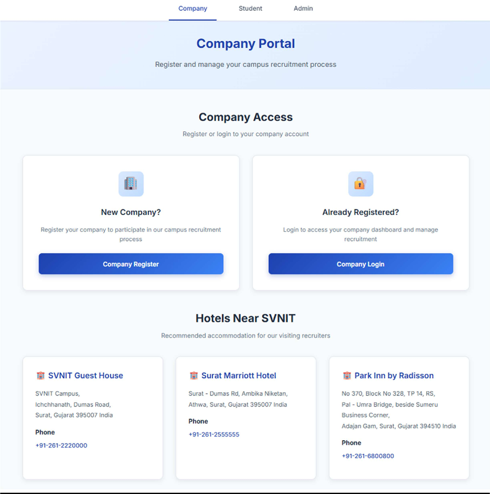

# 🎓 Training & Placement Cell Portal - SVNIT

<div align="center">


**A secure web-based portal for managing Training and Placement activities at Sardar Vallabhbhai National Institute of Technology (SVNIT), Surat.**

[](https://www.php.net/)
[](https://www.mysql.com/)
[](LICENSE)
[](#security-features)

</div>

---

## Tech Stack
- PHP
- MySQL
- JavaScript
- HTML/CSS
- XAMPP

## My Contributions
Developed collaboratively as a team project, with contributions across:

- Full-stack development for student, company, and admin modules
- Backend logic and MySQL database integration
- Authentication, validation, and security feature implementation
- Enhanced student registration with stronger validation, sanitization, and error handling
- UI development, testing, debugging, and feature integration

## Engineering Challenges Solved
- Improved server-side and client-side input validation & Sanitization
- Role-based access control across multiple user types
- SQL injection prevention using prepared statements
- CSRF protection for form security
- Secure Password Hashing
- Session Security &  XSS Protection

---

## Screenshots

### Landing Page
<p align="center">
  
</p>

### Student Registration
<p align="center">
  
</p>

### Admin Dashboard
<p align="center">
  
</p>

### Company Dashboard
<p align="center">
  
</p>

---

## 🚀 Features

### For Students
- Separate Internship & Placement portals
- Profile management
- Company applications
- Notifications

### For Companies
- Registration & approval system
- Post opportunities
- Manage applications
- Student database access

### For Administrators
- User management
- Company approval
- Notification system
- Reports & analytics

---

## 📋 Quick Start

1. **Install XAMPP** and start Apache & MySQL
2. **Copy files** to `C:\xampp\htdocs\TnP`
3. **Import database**: `database/database1.sql` via phpMyAdmin
4. **Create `.env` file** from `env.example` and configure email
5. **Access**: `http://localhost/TnP/svnit.php`

For detailed instructions, see [docs/README.md](docs/README.md)

---

## 📁 Project Structure

```
TnP/
├── config/              # Configuration files
│   ├── config.php       # Main configuration
│   ├── load_env.php     # Environment loader
│   └── server.php       # Session configuration
├── includes/            # Security & utility files
│   ├── csrf.php         # CSRF protection
│   └── security.php     # Security helpers
├── student/             # Student portal
│   ├── login/          # Login pages
│   ├── register/       # Registration
│   ├── dashboard/      # Dashboard & features
│   └── profile/        # Profile management
├── company/             # Company portal
│   ├── login/          # Login pages
│   ├── register/       # Registration
│   └── dashboard/      # Dashboard & features
├── admin/               # Admin portal
│   ├── login/          # Login pages
│   ├── register/       # Registration
│   └── dashboard/      # Admin features
├── assets/              # Static assets
│   └── images/         # Image files
├── lib/                 # Third-party libraries
│   ├── class.phpmailer.php
│   └── class.smtp.php
├── database/            # Database files
│   └── database1.sql   # Database schema
├── docs/                # Documentation
│   ├── README.md       # Full documentation
│   ├── SETUP_ENV.md    # Environment setup
│   └── PROJECT_STRUCTURE.md
├── bootstrap.php        # Path configuration
├── svnit.php            # Main landing page
├── env.example          # Environment template
└── .gitignore          # Git ignore rules
```

---

## 📚 Documentation

- **[Full Documentation](docs/README.md)** - Complete project documentation
- **[Environment Setup](docs/SETUP_ENV.md)** - Email & environment configuration
- **[Project Structure](docs/PROJECT_STRUCTURE.md)** - Detailed file organization

---

## Demo
Live deployment coming soon

---